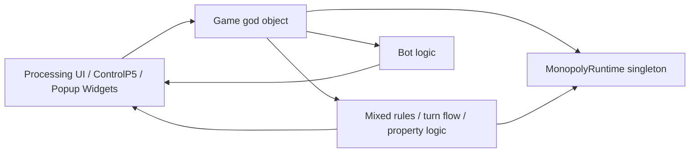
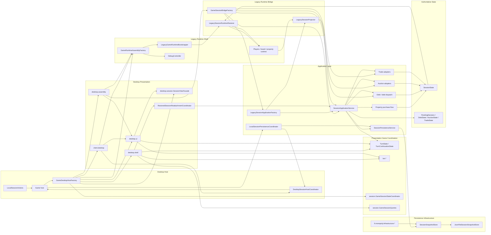
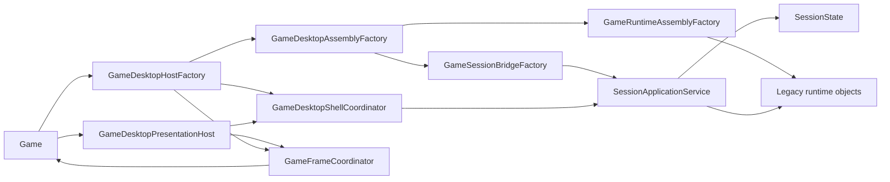
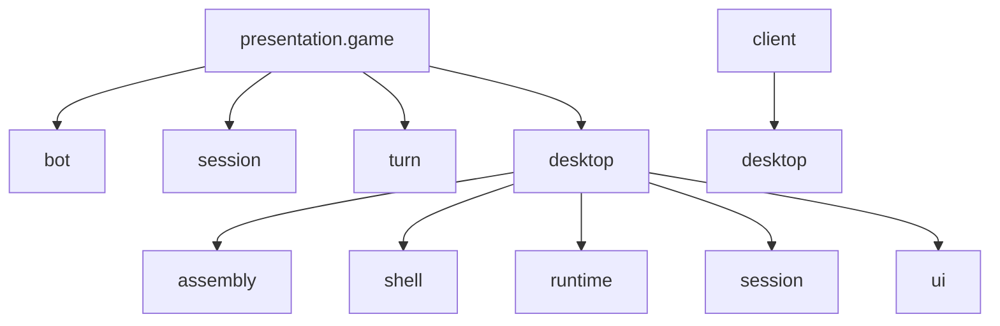
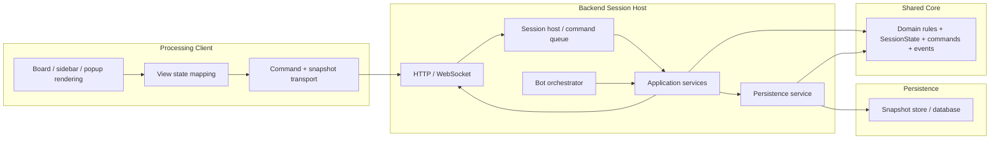
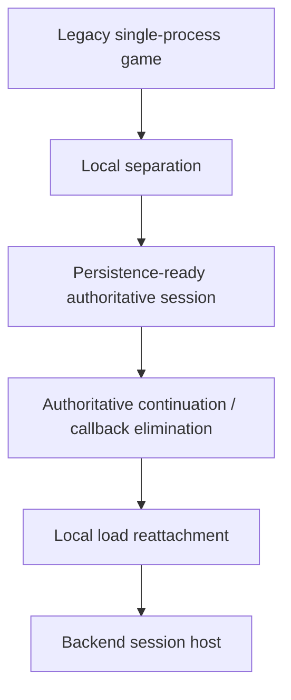

# Architecture Overview Diagrams

## Purpose

This file is the fast visual companion to the longer architecture docs.

Use it when you want a quick answer to:

- what the current app architecture roughly looks like
- what the current local-first separated shape looks like
- what the intended backend-ready target shape looks like

The diagrams are intentionally high-level. They are not a class diagram and they do not try to show every adapter.

## 1. Before Separation

This is the legacy shape the project started from conceptually.

What this means:

- the UI, orchestration, and rule authority were too mixed together
- popup flow was often effectively gameplay flow
- bot execution depended too much on client/runtime assumptions

## 2. Current Structure In This Repo

This is the rough shape now after the local separation work currently implemented.

What is important here:

- `Game` is now more clearly a desktop host/compatibility surface, not the only place where wiring lives
- desktop code is explicitly split into `client.desktop`, `assembly`, `shell`, `runtime`, `session`, and `ui`
- turn flow, bot flow, and desktop session state are now separated into `turn`, `bot`, and `session` packages
- local save/load still works through a narrow `SessionHost` seam instead of direct rebuild callbacks
- authoritative state still lives in `SessionState` and related domain records, not only in live UI/runtime objects
- the Processing entry app and runtime now both live under `client.desktop`, so the root package no longer owns desktop bootstrap/runtime classes
- desktop-only global flags such as debug mode and skip-animations now live in explicit `client.desktop` settings/state helpers instead of `MonopolyApp`
- desktop control-layer and font resources are also isolated behind `client.desktop` runtime resource helpers instead of hanging off `MonopolyApp`
- the current Processing app instance is now accessed through an explicit `client.desktop` context seam instead of `MonopolyApp.self`
- shared rendering helpers now depend on a small `client.desktop` rendering context seam instead of the full `MonopolyApp` type
- frame/layout/session orchestration code now reads time and viewport state through `MonopolyRuntime` helpers instead of reaching directly into Processing app fields
- projected desktop session views now read popup state through explicit collaborators instead of depending on the full runtime shell
- the remaining `Game` host constructor is now driven through an explicit desktop bootstrap factory instead of assembling controls, shell, and presentation inline
- embedded desktop session hosting now targets a small hosted-game interface instead of depending on the full `Game` host type for normal session/view lifecycle operations
- the legacy bridge is still present because the Processing desktop client still runs on legacy runtime objects
- the main remaining monolith is the `Game` host itself, which now delegates more but still exposes many compatibility hooks for tests and the current desktop client

## 3. Current Practical Runtime Shape

This is the short “how the running app is assembled today” view.

This is already much closer to backend-safe behavior than the original project shape, but not fully backend-clean yet because:

- the desktop client still owns the authoritative application service instance locally
- the bridge still mutates legacy runtime objects in-process
- `Game` still exposes a broad compatibility surface for tests and local desktop orchestration, even though frame and session-view work now sits behind `GameDesktopPresentationHost`

## 4. Current Package View

This is the shortest package-oriented map of the current gameplay presentation structure.

Useful mental model:

- `bot`: bot scheduling and bot turn stepping
- `session`: desktop session state/presentation coordination
- `turn`: actual turn flow orchestration
- `client.desktop`: Processing app-facing shell and runtime adapters around the embedded local host
- `desktop.assembly`: object graph construction
- `desktop.shell`: orchestration between host and extracted coordinators
- `desktop.runtime`: legacy runtime bootstrap and lifecycle
- `desktop.session`: session bridge and restored-session reattachment
- `desktop.ui`: controls, layout, frame rendering, input binding, and the extracted desktop presentation host

## 5. Target Backend-Ready Architecture

This is the intended future shape after the remaining local cleanup and server extraction.

What changes at that point:

- the server owns authoritative state
- bots run on the server
- the client only sends commands and renders approved state
- save/load and reconnect semantics are the same system, not separate systems

## 6. Migration Summary

Current practical status:

- `A -> B` is largely done
- `C`, `D`, and `E` are now substantially in place
- the remaining local cleanup now mostly means shrinking `Game` further and reducing remaining desktop-host compatibility glue
- `F` is still the next major architecture milestone after that
