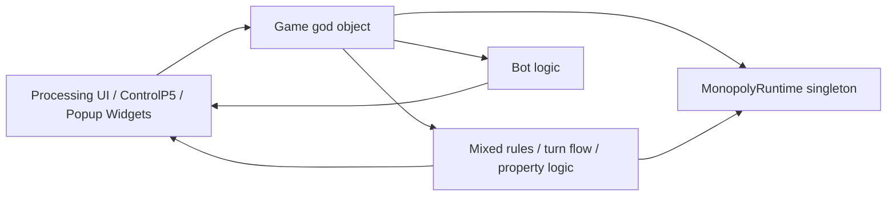
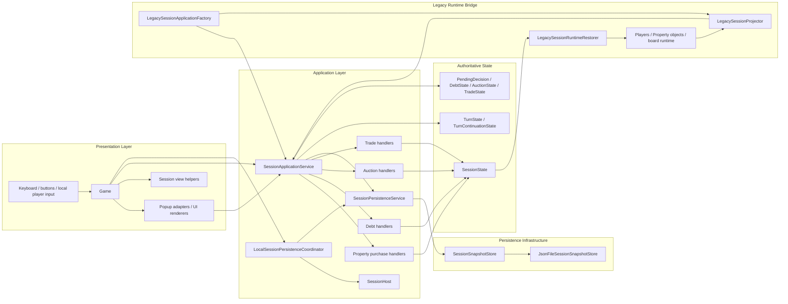
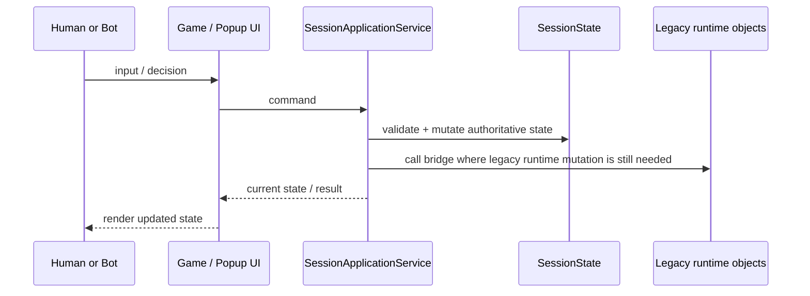
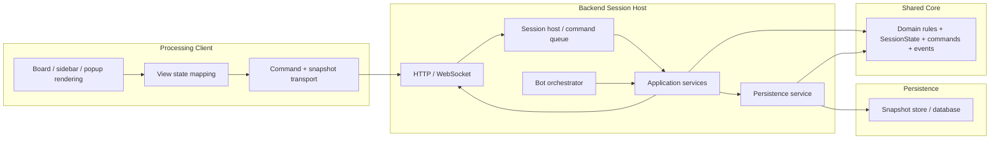
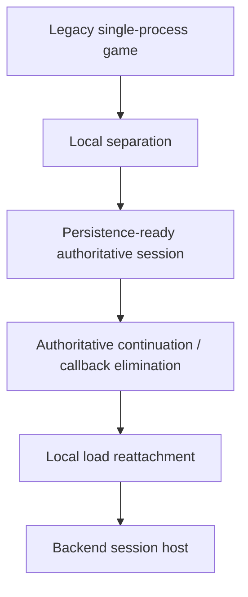

# Architecture Overview Diagrams

## Purpose

This file is the fast visual companion to the longer architecture docs.

Use it when you want a quick answer to:

- what the current app architecture roughly looks like
- what the current local-first separated shape looks like
- what the intended backend-ready target shape looks like

The diagrams are intentionally high-level. They are not a class diagram and they do not try to show every adapter.

## 1. Before Separation

This is the legacy shape the project started from conceptually.

What this means:

- the UI, orchestration, and rule authority were too mixed together
- popup flow was often effectively gameplay flow
- bot execution depended too much on client/runtime assumptions

## 2. Current Direction In This Repo

This is the rough shape now after the local separation work already implemented.

What is important here:

- authority has moved much more clearly into command/state/application types
- `Game` is no longer the only place that understands gameplay progression
- persistence now works against `SessionState`, not only live UI/runtime state
- local save/load now depends on a small `SessionHost` seam instead of directly owning rebuild/state callbacks
- snapshot storage has a swap-ready store seam, so local JSON is no longer the only assumed persistence backend
- the legacy `SessionApplicationService` wiring has been centralized behind `LegacySessionApplicationFactory`, which makes the remaining runtime bridge more explicit
- there is still a legacy bridge because the Processing client still runs against runtime objects

## 3. Current Practical Runtime Shape

This is the short “how the running app behaves today” view.

This is already much closer to backend-safe behavior than the original project shape, but not fully backend-clean yet.

## 4. Target Backend-Ready Architecture

This is the intended future shape after the remaining local cleanup and server extraction.

What changes at that point:

- the server owns authoritative state
- bots run on the server
- the client only sends commands and renders approved state
- save/load and reconnect semantics are the same system, not separate systems

## 5. Migration Summary

Current practical status:

- `A -> B` is largely done
- `C`, `D`, and `E` are now substantially in place
- `F` is the next major architecture milestone, but there is still some local cleanup value before starting it fully
